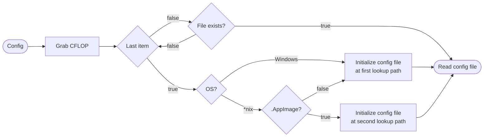

# **[ura](../index.md).[src](../src.md).[globals](globals.md)**

## **Variables**

`CFLOP`



## **Functions**

<h3><b><a href="#func-init" id="func-init">init</a></b></h3>

```python
(idx: int) ‑> None
```
