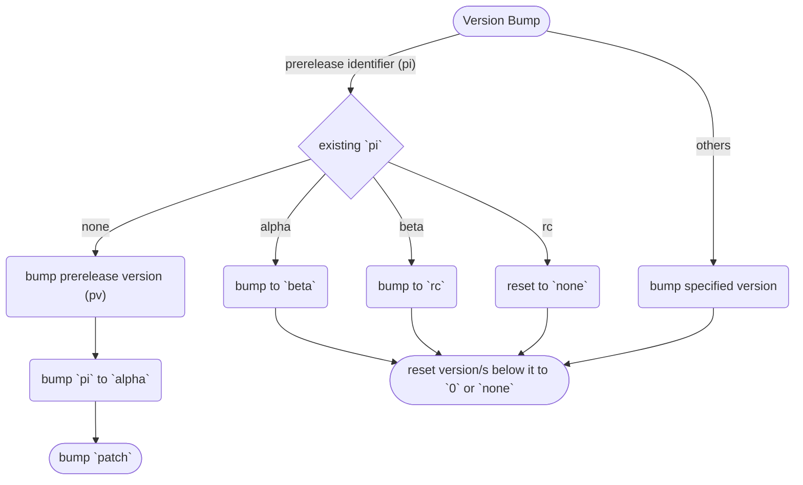
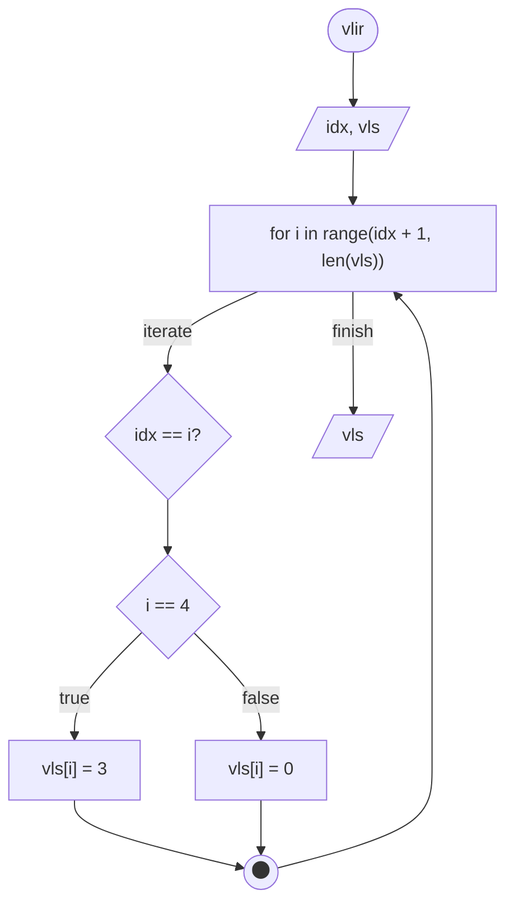
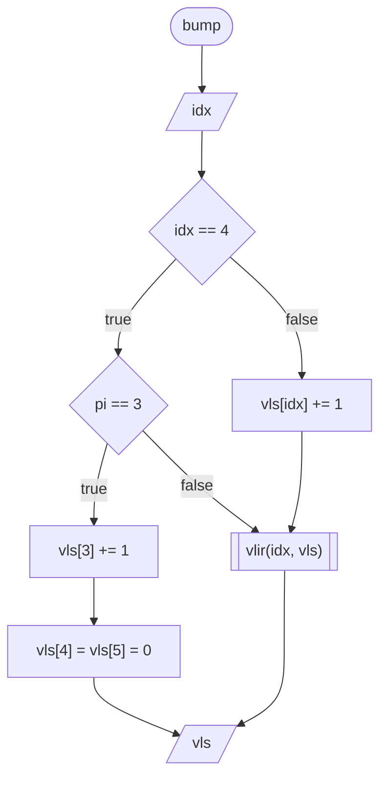

<h1 align="center" style="font-weight: bold">
    Notes
</h1>

## **Versioning System**

Hyaku uses modified semver. This is due to the fact that I believe that I, the developer of this app, introduces too much breaking change to the API without noticeable changes to the user interface and/or experience. And such, I have decided to use the following versioning system:

Given a version number `user.dev.minor.patch`, increment the:

- `user` version when you make any changes to the user interface/experience. This however does not include improvements on loading times, despite being well within the user experience umbrella, as it is considered as an optimization to the code, and the experience will be subjective.
- `dev` version when you make incompatible API changes,
- `minor` version when you add functionality in a backwards compatible manner, and
- `patch` version when you make backwards compatible bug fixes.

Anything else adheres to the [semantic versioning 2.0.0](https://semver.org/spec/v2.0.0.html).

### **Flowchart**



### **Technical Details**

#### **version.yml**

The file which contains the different version formats is `version.yml`.

Example format:

```yml
ls: [0, 0, 0, 0, 0, 5]
str: 0.0.0.0-alpha.5
sv: 0.0.1-alpha.5
```

#### ***vls***

`vls` is the list of version numbers, and corresponds to the `user`, `dev`, `minor`, `patch`, `prerelease identifier`, and `prerelease version` respectively.

#### ***str***

`str` is the string representation of the version list.

#### ***sv***

`sv` is the string representation of the version list, fitted awkwardly to conform with the semver.

The `minor` and `patch` are raised to the power of 3 and 2 respectively, then multiplied together to form the `patch` version of `sv`. While the remaining `user` and `dev` versions are made to be the `major` and `minor` version.

This is done as the `minor` and `patch` of the `vls` can be easily converted back through prime factorization.

#### **Bumping**

#### ***vlir***



#### ***bump***



## **Changelog**

As used in the changelog, the following types of changes shall have the following implications, of which, their allowed version bumps should be everything, unless explicably stated otherwise:

- `Added`
  For adding new features.
  - user
  - dev
  - minor
- `Changed`
  For changes in existing functionality.
  - user
  - dev
- `Deprecated`
  For marking features as `deprecated`.
  - patch
- `Removed`
  For removing features.
  - user
  - dev
- `Fixed`
  For any kind of fixes, formatting not included.
- `Security`
  For any attempts to fix a security vulnerability.

Example format:

```md
## 1.0.0.0-rc.1 (pre-release identifier bump)

Concisely describe changes in this release.

### Added

- List additions here.
```

## **Developer Utilities**

The included developer utilities in this repository are hard to document, as it has grew to such an extent that it is naught but futile to document it all.

May I never forget what I did there, and how it works, as it literally helps me get this repository out.

## **Documentation** <small><font color="#ED5E5E">notes to developer</small></font>

The documentation system is a custom solution.

If the documentation generator fails, check the traceback. It is commonly due to errors in the code and not the generator itself.

Do not blame the shitty generator you wrote. You might just have written a faulty code.

### **Headings**

I like to use headings to organize my documentations. However, only 4 of them are usable as h5 and h6 is much smaller than the body text. And such, I have devised a system to be able to extend the headings.

```md
# **h1**
## **h2**
### **h3**
#### **h4**
#### ***h5***
#### *h6*
#### h7
```

This works when you only have up to 7 headings, however, to extend it further more, you have to use this extension technique from 1 header higher until reaching the desired number of headings as shown below:

```md
# **h1**
## **h2**
### **h3**
### ***h4***
### *h5*
### h6
#### **h7**
#### ***h8***
#### *h9*
#### h10
```

Anyways, I want to be able to do this automatically in the future.
